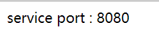

参考
https://github.com/apache/incubator-dubbo-spring-boot-project

# master分支
先启动zookeeper，然后启动consumer，再启动provider

访问consumer端口 [http://localhost:8081/get](http://localhost:8081/get)

结果输出

# dubbo异步demo
#### 需要切换到dubbo-async分支
先启动zookeeper，然后启动consumer，再启动provider

访问consumer端口 [http://localhost:8081/test](http://localhost:8081/test)

需要5秒等待，返回结果

#### 异步调用
访问[http://localhost:8081/test2](http://localhost:8081/test2)
立即返回null，控制台等待返回后输出
